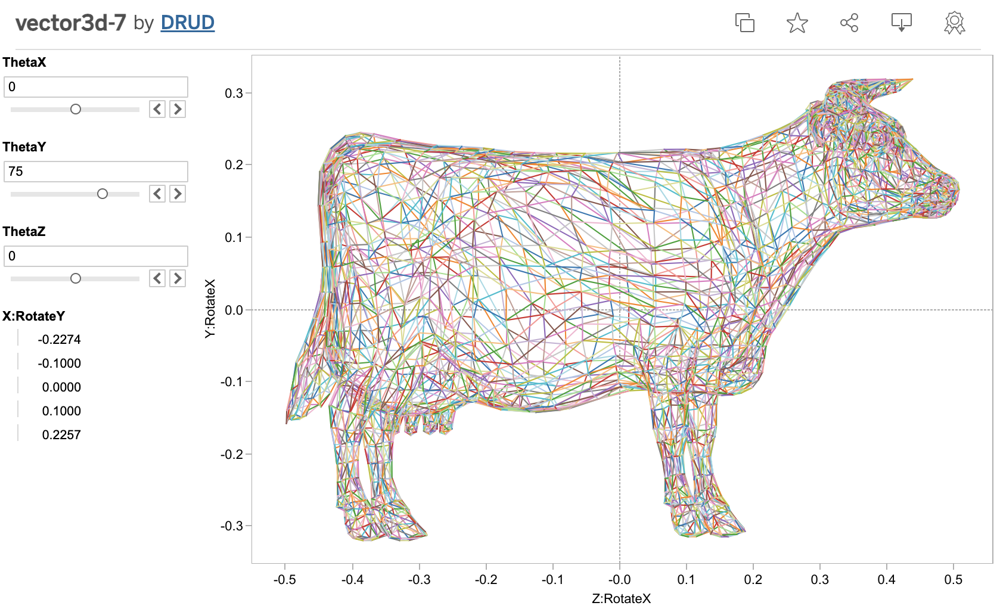

Convert a [3D object geometry definition OBJ file](https://en.wikipedia.org/wiki/Wavefront_.obj_file) ([examples](https://people.sc.fsu.edu/~jburkardt/data/obj/obj.html))
into a CSV file for [Tableau](https://www.tableau.com/) to ingest so the 3D object can be displayed in Tableau.
An example OBJ file `dodecahedron.obj` is in this repository.

The columns for the CSV file are the X, Y, Z coordinates of vertex points, and
a number indicating a particular edge id of the object. Each edge is defined
by the two rows in the columns that share the same edge id.

Tableau is not meant to display 3D wireframe models. This was just a fun attempt
to make a data visualization tool do something it wasn't designed to do.

The use of the code is explained on [a post in my blog](https://pinpointuncertainty.blogspot.com/2013/11/your-own-3d-rotatable-cow.html)
where there is an example of a rotatable wireframe cow in Tableau, or open
the rotatable cow workbook [here on Tableau Public](https://public.tableau.com/app/profile/drud/viz/shared/3HTMZCRSC).
Static image below:

